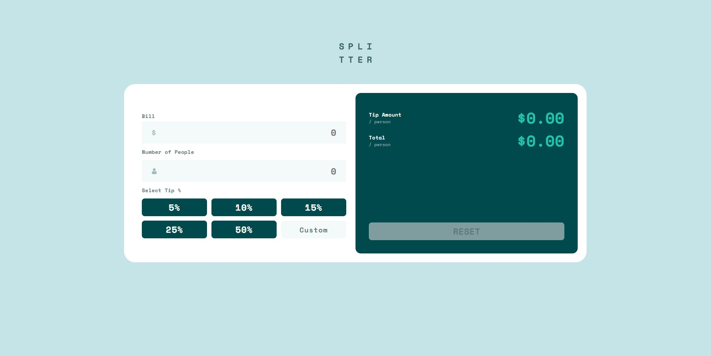

# Frontend Mentor - Tip calculator app solution

This is a solution to the [Tip calculator app challenge on Frontend Mentor](https://www.frontendmentor.io/challenges/tip-calculator-app-ugJNGbJUX). Frontend Mentor challenges help you improve your coding skills by building realistic projects.

## Table of contents

- [Overview](#overview)
  - [The challenge](#the-challenge)
  - [Screenshot](#screenshot)
  - [Links](#links)
- [My process](#my-process)
  - [Built with](#built-with)
  - [What I learned](#what-i-learned)
  - [Continued development](#continued-development)
  - [Useful resources](#useful-resources)
- [Author](#author)
- [Acknowledgments](#acknowledgments)

**Note: Delete this note and update the table of contents based on what sections you keep.**

## Overview

### The challenge

Users should be able to:

- View the optimal layout for the app depending on their device's screen size
- See hover states for all interactive elements on the page
- Calculate the correct tip and total cost of the bill per person

### Screenshot



### Links

- Solution URL: [https://www.frontendmentor.io/solutions/responsive-tip-calculator-app-Cma_rYOPd](https://www.frontendmentor.io/solutions/responsive-tip-calculator-app-Cma_rYOPd)
- Live Site URL: [https://guthribm.github.io/My-Frontend-Mentor-Solutions/challenge%20pages/tip-calculator-app-main/e](https://guthribm.github.io/My-Frontend-Mentor-Solutions/challenge%20pages/tip-calculator-app-main/)

## My process

### Built with

- Semantic HTML5 markup
- CSS custom properties
- Flexbox
- CSS Grid
- Mobile-first workflow

### What I learned

Had to look up a couple solutions involving inputs and their values in order to handle the calculations. Had an issue with NaN displaying and when no values where entered into the inputs but bypasssed that with a turnary

```js
function calculateTotals(tip) {
  let tipTotal = (billTotal / totalPeople) * tip;
  console.log(
    `tip: ${typeof tip} ${tip}\n billTotal: ${typeof billTotal} ${billTotal}\n totalPeople: ${typeof totalPeople} ${totalPeople}\n tipTotal: ${typeof tipTotal} ${tipTotal}\n`
  );
  tipPer.textContent =
    tipTotal.toFixed(2) === "NaN" ? "$0.00" : "$" + tipTotal.toFixed(2);
  totalPlusTip.textContent =
    tipTotal.toFixed(2) === "NaN"
      ? "$0.00"
      : "$" + (billTotal / totalPeople + tipTotal).toFixed(2);
}
```

## Author

- Website - [Brandon Guthrie](https://guthribm.github.io/My-Frontend-Mentor-Solutions/challenge%20pages/tip-calculator-app-main/)
- Frontend Mentor - [@guthribm](https://www.frontendmentor.io/profile/guthribm)
